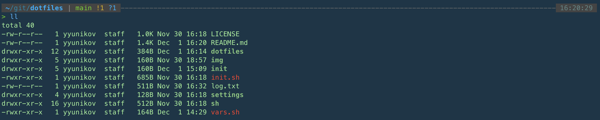
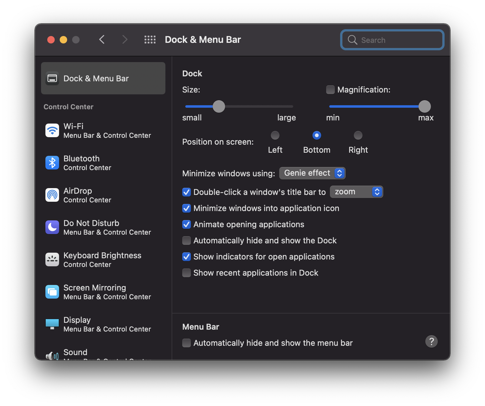

```
     _       _    __ _ _           
  __| | ___ | |_ / _(_) | ___  ___ 
 / _` |/ _ \| __| |_| | |/ _ \/ __|
| (_| | (_) | |_|  _| | |  __/\__ \
 \__,_|\___/ \__|_| |_|_|\___||___/

```
test

Collection of files for mac setup and useful scripts. Thanks to [@max-lobur](https://github.com/max-lobur).

Based on https://github.com/max-lobur/dotfiles.


The above color theme is [Cobalt Neon](https://raw.githubusercontent.com/mbadolato/iTerm2-Color-Schemes/master/schemes/Cobalt%20Neon.itermcolors)

## Mac Setup

### Prerequisites
1. Install Homebrew https://brew.sh
1. Install GPG `brew install gpg`
1. Add existing or generate SSH key in `~/.ssh` (for GitHub see [documentation](https://docs.github.com/en/authentication/connecting-to-github-with-ssh/generating-a-new-ssh-key-and-adding-it-to-the-ssh-agent))
1. Import existing GPG key with `gpg --import key.asc` or create new one
1. Run `gpg --list-secret-keys` to get your `GPG_KEY` for `vars.sh`

### Automated
1. Make sure to sign in with Apple ID
1. Clone it / Fork it to `$HOME/git` directory
1. Update [vars.sh](./vars.sh)
1. Review the [init](./init) scripts, enable/disable stuff
1. Run `./init.sh`

### Manual Steps
1. Remove all default Apple apps from Dock
1. Create Apple folder in Launchpad, add all default Apple apps to it
1. Set wallpaper (`img/wallpaper 4k.jpg`)
1. System Preferences -> Keyboard -> Shortcuts -> Function Keys and add:
	1. "PyCharm"
	1. "Intellij IDEA"
	1. "RubyMine"
	1. "GoLand"
1. Setup Input Sources
1. Authenticate in all apps
1. iTerm Configuration
	1. Launch iTerm and type `p10k configure` for configuration, see [this gist](https://gist.github.com/kevin-smets/8568070) for theme
	1. iTerm -> Preferences -> Appearance -> General -> Minimal
1. Setup Dock



## Troubleshooting
All scripts are idempotent - hack & rerun until it works.
